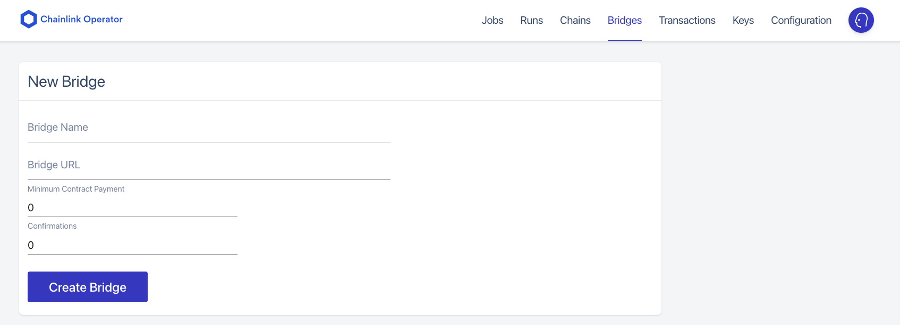

# Halffin

Halffin is a peer to peer marketplace of real world assets using chainlink oracle to track delivery status of buyers shipment ensuring buyers will be charged only if the shipment is delivered. This project is part of Chainlink Hackathon Fall 2021.

## Prerequisites

Please install or have installed the following:

- [nodejs and npm](https://nodejs.org/en/download/)
- [python](https://www.python.org/downloads/)
- [aws](https://aws.amazon.com/)
- [moralis](https://moralis.io/)

## Installation

1. Set up repo

```bash
git clone https://github.com/palsp/halffin-adapter.git
git clone https://github.com/palsp/halffin-frontend.git
```

2. [Install Brownie](https://eth-brownie.readthedocs.io/en/stable/install.html), if you haven't already. Here is a simple way to install brownie.

```bash
python3 -m pip install --user pipx
python3 -m pipx ensurepath
# restart your terminal
pipx install eth-brownie
```

Or, if that doesn't work, via pip

```bash
pip install eth-brownie
```

3. [Set up Chainlink node](https://docs.chain.link/docs/running-a-chainlink-node/)

4. Set up external adapters

- install dependencies

```bash
npm --prefix halffin-adapter install
or
yarn -cwd halffin-adapter install
```

- start server

```bash
yarn emulator:start
```

> NOTE: We use AWS DynamoDB in this step, please set up aws cli and sufficient iam permission to create DynamoDB Table

5. Setup env

Set your `WEB3_INFURA_PROJECT_ID`, `PRIVATE_KEY`, and `CHAINLINK_NODE_ADDRESS` environment variable

- You can get a `WEB3_INFURA_PROJECT_ID` by getting a free trial of [Infura](https://infura.io/)
- You can find your `PRIVATE_KEY` from your ethereum wallet like [metamask](https://metamask.io/).
- You can get a `CHAINLINK_NODE_ADDRESS` from gui of chainlik node.
  - Go to Keys > Account Address > Address

6. deploy oracle

```bash
brownie run scripts/oracle_node/deploy_oracle --network kovan
```

7. Setup bridge and create job

- Copy url of the adapter and paste it the chainlink node gui.
  

> You can use `localhost:3000` for local development

- Create a job in chainlink node gui using the following job's description. Replace `ORACLE_ADDRESS` with the oracle's address deployed in the previous step and `BRIDGE_NAME` with the bridge name.

```toml
type = "directrequest"
schemaVersion = 1
name = "get-tracking-detail"
contractAddress = <ORACLE_ADDRESS>
maxTaskDuration = "0s"
observationSource = """
       decode_log   [type="ethabidecodelog"
                     abi="OracleRequest(bytes32 indexed specId, address requester, bytes32 requestId, uint256 payment, address callbackAddr, bytes4 callbackFunctionId, uint256 cancelExpiration, uint256 dataVersion, bytes data)"
                     data="$(jobRun.logData)"
                     topics="$(jobRun.logTopics)"]

       decode_cbor  [type="cborparse" data="$(decode_log.data)"]
       fetch        [type=bridge name=<BRIDGE_NAME> requestData="{\\"id\\" : $(jobSpec.externalJobID), \\"data\\" : { \\"trackingId\\" : $(decode_cbor.trackingId)}}"]
       parse        [type="jsonparse" path="data,tracking,tag" data="$(fetch)"]
       encode_data  [type="ethabiencode" abi="(bytes32 value)" data="{ \\"value\\": $(parse) }"]
       encode_tx    [type="ethabiencode"
                     abi="fulfillOracleRequest(bytes32 requestId, uint256 payment, address callbackAddress, bytes4 callbackFunctionId, uint256 expiration, bytes32 data)"
                     data="{\\"requestId\\": $(decode_log.requestId), \\"payment\\": $(decode_log.payment), \\"callbackAddress\\": $(decode_log.callbackAddr), \\"callbackFunctionId\\": $(decode_log.callbackFunctionId), \\"expiration\\": $(decode_log.cancelExpiration), \\"data\\": $(encode_data)}"
                   ]
       submit_tx    [type="ethtx" to=<ORACLE_ADDRESS> data="$(encode_tx)"]

       decode_log -> decode_cbor -> fetch -> parse -> encode_data -> encode_tx -> submit_tx
     """
```

- Once created you will received external Job ID. Paste the job id in `brownie-config.yaml` post_job_id field.

8. contract deployment

> NOTE: We will keep our adapter and chainlink node up and running on kovan network until the end of December 2021. if you are running on kovan and wish to use our oracle, feel free to skip to instruction 3.

```bash
brownie run scripts/escrow-factory/deploy_factory.py --network kovan
```

9. Setup frontend

```bash
yarn --cwd halffin-frontend install
```

Set your `REACT_APP_MORALIS_SERVER_URL`, `REACT_APP_MORALIS_APP_ID`, `REACT_APP_TRACKING_SERVER_URL`, and `REACT_APP_NFTSTORAGE_TOKEN` environment variable

- You can get `REACT_APP_MORALIS_SERVER_URL` and `REACT_APP_MORALIS_APP_ID` from your moralis dashboard.
- `REACT_APP_TRACKING_SERVER_URL` is the external adapter from step 3
- You can get `REACT_APP_NFTSTORAGE_TOKEN` from [nft.storage](https://nft.storage/)

10. Deploy Moralis cloud function

```bash
moralis-admin-cli watch-cloud-folder --moralisApiKey <MORALIS_API_KEY>
--moralisApiSecret <MORALIS_API_SECRET> --moralisSubdomain <MORALIS_SUB_DOMAIN> --autoSave 1 --moralisCloudfolder halffin-frontend/cloud_function
```

11. Start frontend

```bash
yarn -cwd halffin-frontend start
```

## Mock Tracking Number

We provide a mock tracking number so that you do not need to ship anything in order to use our platform. Here the list of tracking number as well as its related delivery status

- Delivered

```
HF123456789DL
```

- Fail

```
HF123456789EX
```

- In Transit

```
HF123456789IT
```

## License

This project is licensed under the [MIT license](LICENSE).
